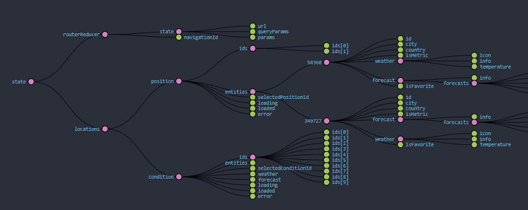

# NgRX Weather App
**Note:** might need CORS extention on the browser
Live demo deployed on Heroku: https://hwa-client.herokuapp.com/

Weather data using [AccuWeather API ](https://www.accuweather.com/)
For documentation see: https://developer.accuweather.com/

## Built with

- Angular 8
- NgRX library
- TypeScript, JavaScript
- Bootstrap 4, CSS3, HTML5
- Node.js

## Prerequisites

- Search weather by city
- Add/remove favorite locations
- Indication if location is already saved in favorites
- Display Tel-Aviv weather by default
- Clicking on a favorite will navigate to the main screen showing the details of that location
- Reactive state management (Redux pattern)
- Error handling

## Features

- Responsive design & animation
- Theme change (dark/light mode)
- Temperature unit change (Celsius/Fahrenheit)
- Current Geolocation tracking

## State tree chart



## Usage

```
$ cd project-folder
$ npm run dev
```

## Packages

**Dependencies**

```
$ npm install --save @ngrx/store @ngrx/store-devtools @ngrx/effects @ngrx/entity bootstrap popper.js jquery
```

**Development dependencies**

```
$ npm install --save-dev json-server concurrently
```

## Issues

- CORS

---

This project was generated with [Angular CLI](https://github.com/angular/angular-cli) version 8.3.12.

## Development server

Run `ng serve` for a dev server. Navigate to `http://localhost:4200/`. The app will automatically reload if you change any of the source files.

## Code scaffolding

Run `ng generate component component-name` to generate a new component. You can also use `ng generate directive|pipe|service|class|guard|interface|enum|module`.

## Build

Run `ng build` to build the project. The build artifacts will be stored in the `dist/` directory. Use the `--prod` flag for a production build.

## Running unit tests

Run `ng test` to execute the unit tests via [Karma](https://karma-runner.github.io).

## Running end-to-end tests

Run `ng e2e` to execute the end-to-end tests via [Protractor](http://www.protractortest.org/).

## Further help

To get more help on the Angular CLI use `ng help` or go check out the [Angular CLI README](https://github.com/angular/angular-cli/blob/master/README.md).
